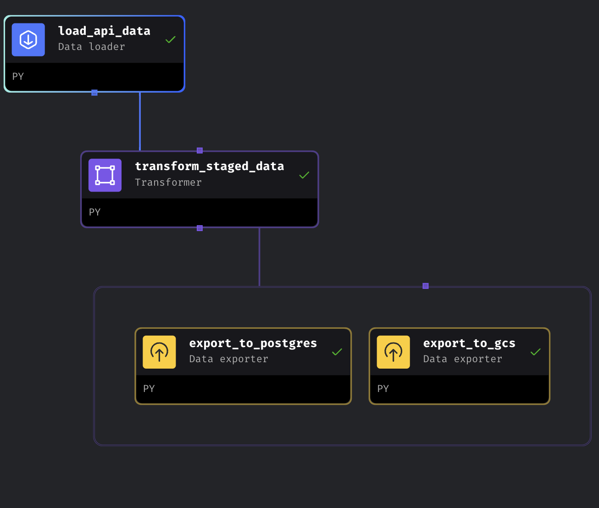

# Docker compose configuration

## Fill .env file with the follwing variables:
- PROJECT_NAME=""
- POSTGRES_DBNAME=""
- POSTGRES_SCHEMA=""
- POSTGRES_USER=""
- POSTGRES_PASSWORD=""
- POSTGRES_HOST=""
- POSTGRES_PORT=""

## run docker-compose.yaml
```dockerfile
docker-compose up -d
```

## check available containers
```dockerfile
docker-compose ps
```

## check all containers
```dockerfile
docker-compose ps -a
```

## check log to a specific container (e.g. ingest_data)
```dockerfile
docker-compose logs -f ingest_data
```

## stop, then delete a specific container (e.g. ingest_data)
```dockerfile
docker-compose stop ingest_data
docker-compose rm ingest_data
```

## rebuild ingest_data (if necessary)
```dockerfile
docker-compose build ingest_data
```

## shell connect to a specific container (e.g. ingest_data)
```dockerfile
docker-compose exec -it ingest_data sh
```

# PGAdmin configuration

```
After login to PgAdmin, right click Servers in the left sidebar.
Click on Register.
Click on Server.
``````

```
Host name / address = pgdatabase
Port = 5432
Maintenance database = postgres
```


# Cloud Infrastructure - Terraform

## Setup GCP service account credentials
```
- Add service account json key file in "runtime" -> "gcp" -> "key"
or
- Export GOOGLE_APPLICATION_CREDENTIALS="<path/to/your/service-account-authkeys>.json"
```

## Initialize the directory
```
terraform init
```

## Format and validate the configuration
```
terraform fmt
```

## Validate your configuration
```
terraform validate
```

## Create infrastructure
```
terraform apply
```

In order to help you, the file titanic_clean.csv is load automatically on GCS through terraform.

# Mage

All files used for green_taxi_etl pipelines are located here: /homework/mage-files.

green_taxi_etl pipelines is as follow:

