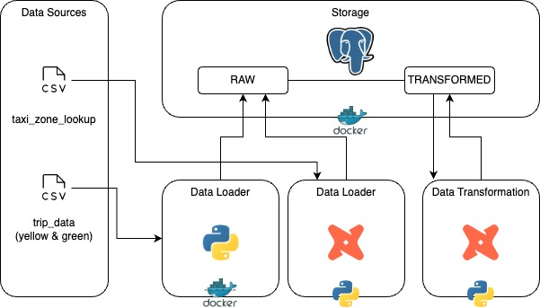
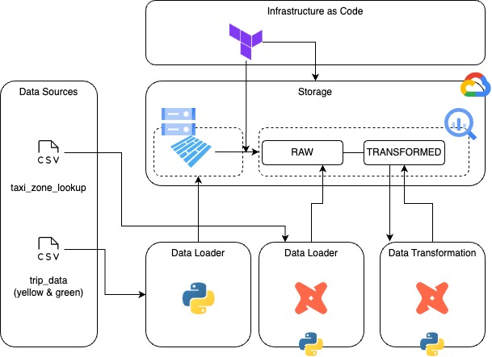

Project has been develop with 2 differents modes:
- local with PostGreSQL
- local with Google Big Query

## local with PostGreSQL
(warning!) it's very slow to import all data - oom can happen.

### Architecture:

### Project Structure:
- docker: build image
- images: architecture diagramme
- src:
  - pyton: data loader script (utilized in docker image)
  - sql: init.sql script
- taxi_rides_ny: dbt project
- docker-compose.yaml : launch services - use is_test_run == true in order to load sample data

## local with PostGreSQL
(recommanded!)

### Architecture:

### Project Structure:
- images: architecture diagramme
- runtime/gcp: terraform layers for infrastructure & data loader
- taxi_rides_ny: dbt project