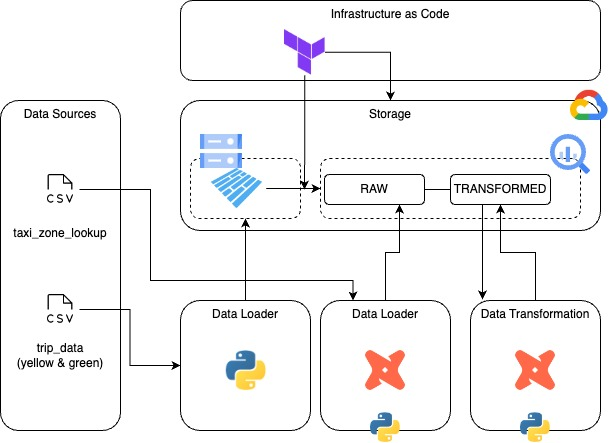

# Cloud Infrastructure - Terraform

## Setup GCP service account credentials
```
- Add service account json key file in "runtime" -> "gcp" -> "key"
or
- Export GOOGLE_APPLICATION_CREDENTIALS="<path/to/your/service-account-authkeys>.json"
```

## Launch the 3 differents layers one by one in order
### Layer 10 : Create GCS
Run the following command:
```
terraform init
terraform apply
```

### Layer 20 : Load file to GCS
Create a python virtual env
```
python -m venv venv
source venv/bin/activate
```

Install libs
```
pip install pandas pyarrow google-cloud-storage python-dotenv
```

Fill .env file with the follwing variables:
```
- GOOGLE_APPLICATION_CREDENTIALS="<path/to/your/service-account-authkeys>.json"
- GCP_GCS_BUCKET="<gcs_bucket_name>"
```

Launch files
```
python web_to_gcs.py
```

### Layer 30 : Create external table from GCS
Run the following command:
```
terraform init
terraform apply
```

# DBT configuration

## Create python virtual env

```
python -m venv venv
source venv/bin/activate
```

[Install dbt with pip documentation](https://docs.getdbt.com/docs/core/pip-install)

## Installing the adapter
```
python -m pip install dbt-bigquery
# check version
dbt --version
```

## Init dbt & check connexion
### (warning) database & schema have to be created before launch dbt debug!
```
dbt init
cp taxi_rides_ny
dbt debug
```

## Try loading taxi_zone_lookup to postGreSQL database
```
dbt seed
```

## Install package dependencies
```
dbt deps
```

## Build project
```
dbt build
```

## Build project for a specific model with a variable
```
dbt build --select stg_green_tripdata --vars '{'is_test_run':'false'}'
```


## Pipeline architecture

