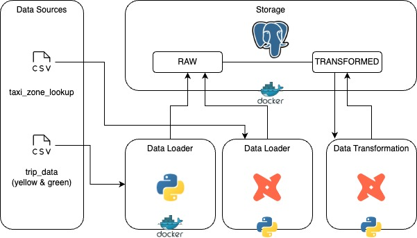

# Docker compose configuration

## Fill .env file with the follwing variables:
- PROJECT_NAME=""
- POSTGRES_DBNAME=nyc_taxi_rides
- POSTGRES_SCHEMA=trip_data_all
- POSTGRES_USER=""
- POSTGRES_PASSWORD=""
- POSTGRES_PORT=5432

## run docker-compose.yaml
```dockerfile
docker-compose up -d
```

## check available containers
```dockerfile
docker-compose ps
```

## check all containers
```dockerfile
docker-compose ps -a
```

## check log to a specific container (e.g. ingest_data)
```dockerfile
docker-compose logs -f ingest_data
```

## stop, then delete a specific container (e.g. ingest_data)
```dockerfile
docker-compose stop ingest_data
docker-compose rm ingest_data
```

## rebuild ingest_data (if necessary)
```dockerfile
docker-compose build ingest_data
```

## shell connect to a specific container (e.g. ingest_data)
```dockerfile
docker-compose exec -it ingest_data sh
```

# PGAdmin configuration

```
After login to PgAdmin, right click Servers in the left sidebar.
Click on Register.
Click on Server.
```

```
Host name / address = pgdatabase
Port = 5432
Maintenance database = postgres
```

# DBT configuration

## Create python virtual env

```
python -m venv venv
source venv/bin/activate
```

[Install dbt with pip documentation](https://docs.getdbt.com/docs/core/pip-install)

## Installing the adapter
```
python -m pip install dbt-bigquery
# check version
dbt --version
```

## Init dbt & check connexion
### (warning) database & schema have to be created before launch dbt debug!
```
dbt init
cp taxi_rides_ny
dbt debug
```

## Try loading taxi_zone_lookup to postGreSQL database
```
dbt seed
```

## Install package dependencies
```
dbt deps
```

## Build project
```
dbt build
```

## Build project for a specific model with a variable
```
dbt build --select stg_green_tripdata --vars '{'is_test_run':'false'}'
```


# Pipeline architecture

