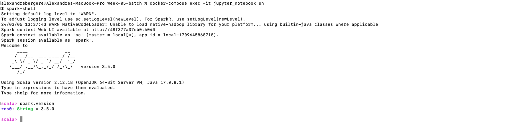

## Week 5 Homework

## Question 1. Install Spark and PySpark
### Execute spark.version. What's the output?
- `res0: String = 3.5.0`
```sh
docker-compose exec -it jupyter_notebook sh
```
```sh
spark-shell
```
```scala
spark.version
```



## Question 2.
### What is the average size of the Parquet (ending with .parquet extension) Files that were created (in MB)? Select the answer which most closely matches.
- 6MB
```python
# Read the October 2019 FHV into a Spark Dataframe
csv_path = "/sparkdata/taxi_trip/fhv/2019/10/fhv_tripdata_2019_10.csv.gz"
df = spark.read.csv(csv_path, header=True, inferSchema=True)

# Repartition the Dataframe to 6 partitions and save it to parquet.
df.repartition(6)
df.write.parquet('/sparkdata/target/fhv/2019/10')
```

## Question 3. Count records
### How many taxi trips were there on the 15th of October?
- 62 610
```python
## How many taxi trips were there on the 15th of October?
from pyspark.sql import functions as F
df = (
    df
    .withColumn('pickup_date', F.to_date(df.pickup_datetime))
    .withColumn('dropoff_date', F.to_date(df.dropOff_datetime))
)
print(df.filter(df.pickup_date == '2019-10-15').count())
```

## Question 4. Largest trip for each day
### Longest trip for each day
- 631 152.50
```python
## What is the length of the longest trip in the dataset in hours?
(
    df
    .withColumn('trip_time', F.round((F.col("dropOff_datetime").cast("long") - F.col("pickup_datetime").cast("long"))/3600,2))
    .select(F.max(F.col('trip_time')))
    .show()
)
```

## Question 5. User Interface
### Spark’s User Interface which shows the application's dashboard runs on which local port?
- 4040

Every SparkContext launches a Web UI, by default on port 4040, that displays useful information about the application. This includes:
- A list of scheduler stages and tasks
- A summary of RDD sizes and memory usage
- Environmental information.
- Information about the running executors

Full documentation [here](https://spark.apache.org/docs/latest/monitoring.html).

## Question 6. Least frequent pickup location zone
### Using the zone lookup data and the FHV October 2019 data, what is the name of the LEAST frequent pickup location Zone?
- Jamaica Bay
```python
## Using the zone lookup data and the FHV October 2019 data, what is the name of the LEAST frequent pickup location Zone?
location = spark.read.csv("/sparkdata/taxi_trip/taxi_zone_lookup.csv", header=True, inferSchema=True)
(
    df.alias('fhv')
    .join(location.alias('l'), F.col('l.LocationID') == F.col('fhv.PUlocationID'))
    .groupBy(F.col('Zone'))
    .count()
    .orderBy('count', ascending=True)
    .show()
)
```