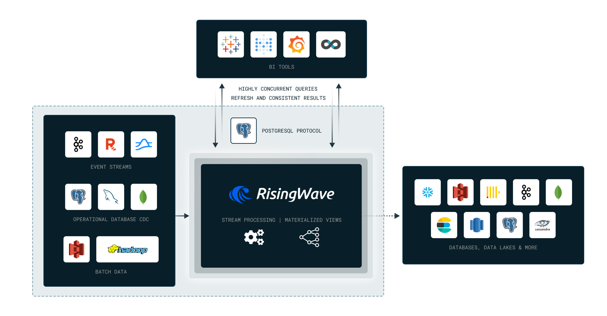

# Workshop 2 - risingWave



## Question 0: What are the dropoff taxi zones at the latest dropoff times?
- Midtown Center
```sql
CREATE MATERIALIZED VIEW latest_dropoff_times AS
  WITH t AS (
    SELECT MAX(tpep_dropoff_datetime) AS latest_dropoff_time
    FROM trip_data
  )
  SELECT taxi_zone.Zone as taxi_zone, latest_dropoff_time
  FROM t,
    trip_data
  JOIN taxi_zone
    ON trip_data.DOLocationID = taxi_zone.location_id
  WHERE trip_data.tpep_dropoff_datetime = t.latest_dropoff_time;
```

## Question 1: 
### Create a materialized view to compute the average, min and max trip time between each taxi zone.

### From this MV, find the pair of taxi zones with the highest average trip time. You may need to use the dynamic filter pattern for this.

### Bonus (no marks): Create an MV which can identify anomalies in the data. For example, if the average trip time between two zones is 1 minute, but the max trip time is 10 minutes and 20 minutes respectively.

- Yorkville East, Steinway
```sql
CREATE MATERIALIZED VIEW zone_stats AS
  SELECT 
    pu_zone.Zone as pickup_zone, 
    do_zone.Zone as dropoff_zone, 
    AVG(trip_data.tpep_dropoff_datetime - trip_data.tpep_pickup_datetime) as avg_time,
    MIN(trip_data.tpep_dropoff_datetime - trip_data.tpep_pickup_datetime) as min_time,
    MAX(trip_data.tpep_dropoff_datetime - trip_data.tpep_pickup_datetime) as max_time
  FROM trip_data
  JOIN taxi_zone pu_zone
    ON trip_data.PULocationID = pu_zone.location_id                 
  JOIN taxi_zone do_zone
    ON trip_data.DOLocationID = do_zone.location_id
  WHERE trip_data.PULocationID != trip_data.DOLocationID
  GROUP BY 
    pu_zone.Zone, do_zone.Zone
  ORDER BY 3 DESC;

SELECT * FROM zone_stats
```

## Question 2: 
### Recreate the MV(s) in question 1, to also find the number of trips for the pair of taxi zones with the highest average trip time.
- 1
```sql
CREATE MATERIALIZED VIEW zone_stats AS
  SELECT 
    pu_zone.Zone as pickup_zone, 
    do_zone.Zone as dropoff_zone, 
    AVG(trip_data.tpep_dropoff_datetime - trip_data.tpep_pickup_datetime) as avg_time,
    MIN(trip_data.tpep_dropoff_datetime - trip_data.tpep_pickup_datetime) as min_time,
    MAX(trip_data.tpep_dropoff_datetime - trip_data.tpep_pickup_datetime) as max_time
  FROM trip_data
  JOIN taxi_zone pu_zone
    ON trip_data.PULocationID = pu_zone.location_id                 
  JOIN taxi_zone do_zone
    ON trip_data.DOLocationID = do_zone.location_id
  WHERE trip_data.PULocationID != trip_data.DOLocationID
  GROUP BY 
    pu_zone.Zone, do_zone.Zone
  ORDER BY 3 DESC;

SELECT * FROM zone_stats
```

## Question 3:
### From the latest pickup time to 17 hours before, what are the top 3 busiest zones in terms of number of pickups? For example if the latest pickup time is 2020-01-01 12:00:00, then the query should return the top 3 busiest zones from 2020-01-01 11:00:00 to 2020-01-01 12:00:00.
- LaGuardia Airport, Lincoln Square East, JFK Airport
```sql
CREATE MATERIALIZED VIEW latest_17_hours_pickups AS
  WITH latest_pickup_time AS (
    SELECT MAX(tpep_pickup_datetime) AS latest_pickup_time
    FROM trip_data
  )
  SELECT 
    pu_zone.Zone as pickup_zone, 
    COUNT(1) as count
  FROM trip_data
  JOIN taxi_zone pu_zone
    ON trip_data.PULocationID = pu_zone.location_id
  WHERE tpep_pickup_datetime > (SELECT latest_pickup_time - INTERVAL '17' HOUR FROM latest_pickup_time)
  GROUP BY 
    pu_zone.Zone
  ORDER BY 2 DESC, 1 DESC;

SELECT * FROM latest_17_hours_pickups
```